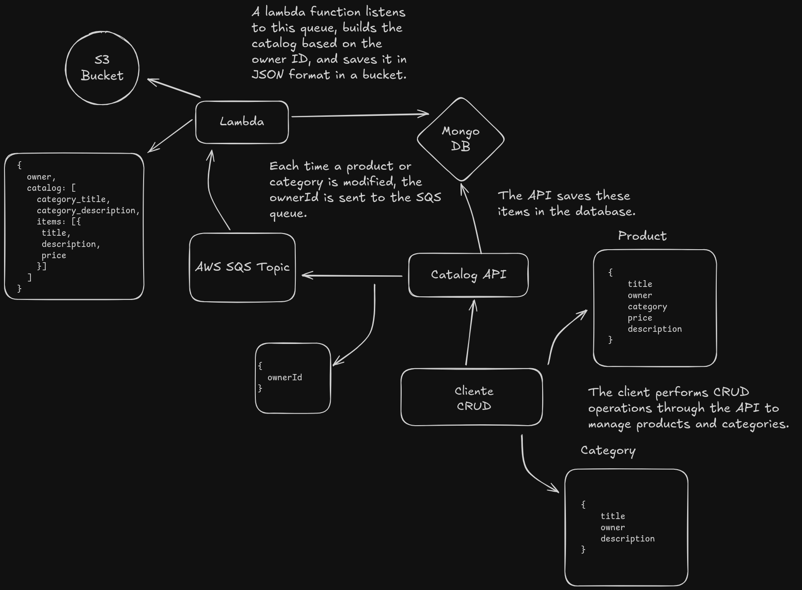

# Backend Analyst Candidate Test

## Description

This is a test to develop an API using Node.js for a product catalog management system in a marketplace application. I used this test to study about AWS services such as SNS, SQS, Lambda and S3 buckets.

The following diagram shows the architecture of the system:

This was a fun project to work on and I learned a lot about AWS services. I hope you enjoy it!

You can see the challenge description [here](https://github.com/githubanotaai/new-test-backend-nodejs).
